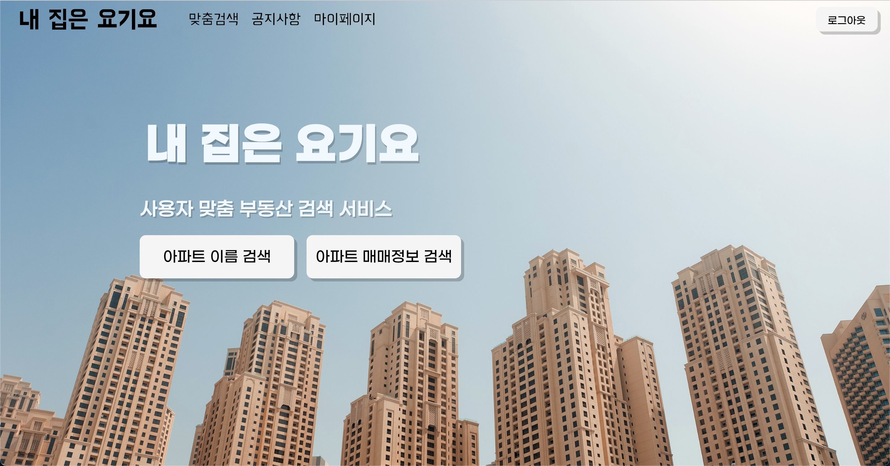
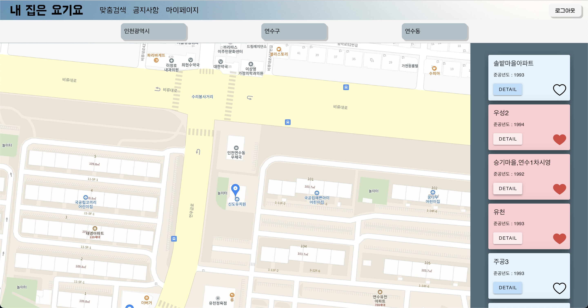
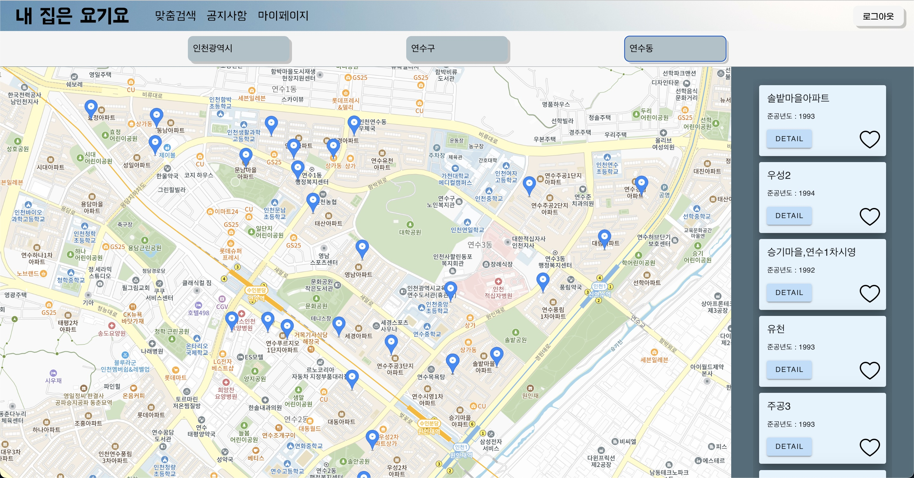
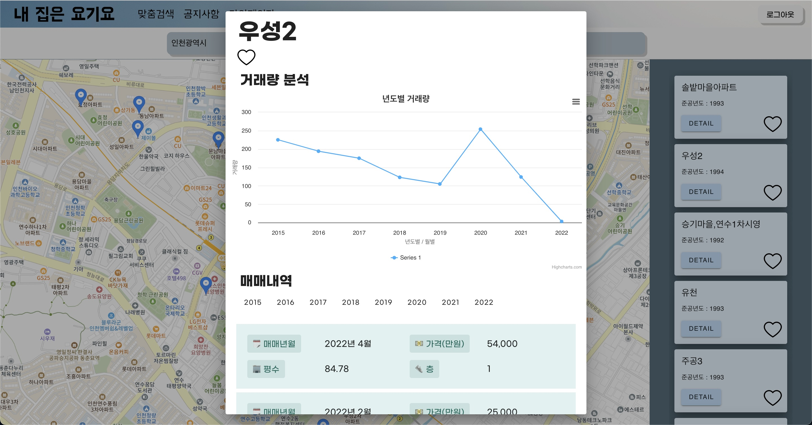
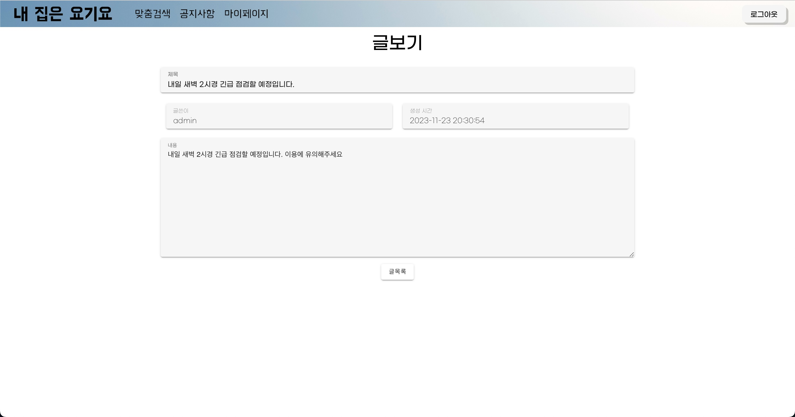

# 🏡 내집은 요기요 (MyHomeYogiyo)

SSAFY 10기 1학기 관통프로젝트

부동산 정보 제공 웹 서비스 "내 집은 요기요"

개발기간 : 23.11.16 ~ 23.11.24


## 팀 소개

|                     [권현준](https://github.com/Kwonhyunjun)                     |                    [김예현](https://github.com/yeaaaaahhhhh)                     |
| :------------------------------------------------------------------------------: | :------------------------------------------------------------------------------: |
|  |  |
|                                  팀장 / 풀스택                                   |                                      풀스택                                      |

---

## Stacks

### Environment

   

### Config


### Development

Frontend

  

Backend

    

### Communication

  

---

## 시작 가이드

### Installation

```
$ git clone https://github.com/MyHomeYogiyo/MyHomeYogiyo.git
$ cd MyHomeYogiyo
```

### Backend

```
$ cd BE/MyHomeYogiyo
$ ./mvnw spring-boot:run
```

### Frontend

```
$ cd FE
$ npm install 
$ npm run dev
```

---

## 프로젝트 소개

사용자에게 특정 지역의 부동산 매매정보를 제공함으로써 더 나은 의사결정을 도와주는 웹 서비스

### ⚡ 지역별 부동산 매매정보 검색 기능
<div align="center">
    
</div> 

+ 매물 좋아요

<div align="center">
    
</div> 

+ 부동산 매매정보 지역별 조회 기능

<div align="center">
    
</div> 

+ 연도별 거래량 리스트 및 분석 그래프 조회 기능

<div align="center">
    
</div>

### ⚡ 게시판 기능

+ 공지사항 CRUD

<div align="center">
    
</div> 

